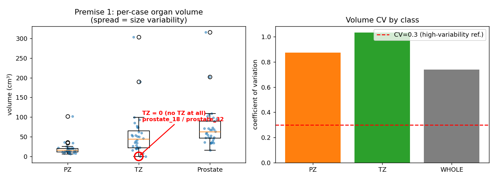
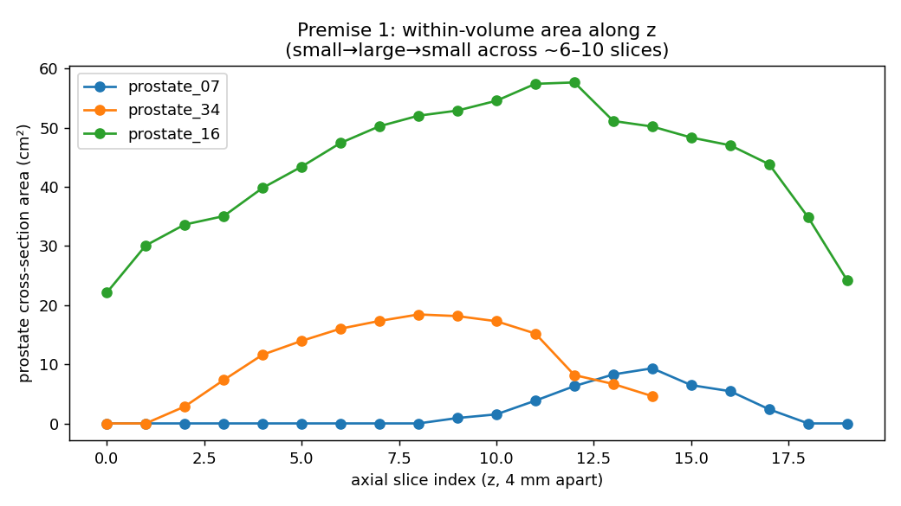

# SwinUNETR-V2 醫學影像分割 (Medical Image Segmentation)

這是一個基於 MONAI 與 SwinUNETR 模型的 3D 醫療影像分割專案。
完美支援 MSD (Medical Segmentation Decathlon) 的三個經典任務，並且解決了記憶體爆滿的問題：
- **Task 05**: Prostate (攝護腺 MRI)
- **Task 06**: Lung (肺部 CT)
- **Task 07**: Pancreas (胰臟 CT)

> **模型架構**：本專案在 `main.py` / `test.py` 中以 `use_v2=True` 啟用 MONAI `SwinUNETR` 的
> **V2 結構**（每個 stage 開頭加上 stage-wise 殘差卷積 ResConv block），對應 SwinUNETR-V2 論文。
> 若要改用原版 SwinUNETR backbone，把這兩處的 `use_v2=True` 移除即可（注意訓練與測試需一致）。

> **作業系統**：Windows 用 `run.bat`，Linux / WSL / macOS 用 `run.sh`（指令參數相同，以下兩種寫法擇一）。

> **期末實驗（Decoder Attention Gate）**：論文重現之外的改造實驗放在 `feat/decoder-attention-gate`
> 分支，詳見本文件最後的「**Part B：期末實驗**」。

---

# Part A：論文重現（基礎使用）

## 🛠 1. 環境安裝 (Installation)
請確保你的電腦有安裝 Python (建議 3.9+) 以及對應你顯示卡的 PyTorch (需支援 CUDA)。
打開終端機 (Terminal / PowerShell)，依序執行：
```bash
# 把專案抓下來
git clone https://github.com/edge121212/SwinUNETR-V2.git

# 進入資料夾
cd SwinUNETR-V2

# 先裝對應 CUDA 版本的 PyTorch（requirements.txt 不含 torch），例如：
pip install torch --index-url https://download.pytorch.org/whl/cu121

# 安裝其餘必備套件
pip install -r requirements.txt
```

---

## 📥 2. 下載資料集 (Download Datasets)
我們提供了一個防呆腳本，可以一鍵下載並自動解壓縮：
*(注意：醫療影像檔案極大，請確保硬碟有足夠空間)*

```cmd
:: Windows
.\run.bat download Prostate      :: 下載指定器官 (Lung / Prostate / Pancreas)
.\run.bat download All           :: 一次載滿三個
```
```bash
# Linux / WSL / macOS
./run.sh download Prostate
./run.sh download All
```
下載完成後，資料集會自動放在 `dataset/` 目錄下。

---

## 🏋️ 3. 模型訓練 (Training) — 單一 fold
下載完資料集後，直接呼叫腳本即可開始訓練（只跑 fold 0，適合快速驗證流程）。

```cmd
:: Windows
.\run.bat train Prostate
```
```bash
# Linux / WSL
./run.sh train Prostate
```
訓練好的權重會自動存檔在 `runs/` 對應的資料夾裡面。
可在指令最後加上 epoch 數覆寫預設值，例如 `./run.sh train Prostate 500`。

---

## 🧪 4. 模型測試 (Testing) — 單一 fold
訓練結束後，想看看模型有多準（計算 Dice Score），請執行：

```cmd
:: Windows
.\run.bat test Prostate
```
```bash
# Linux / WSL
./run.sh test Prostate
```
分數會直接顯示在螢幕上，並且 Prostate 任務會貼心地幫你拆分出 PZ (周邊區) 與 TZ (過渡區) 的獨立分數！
測試讀取的是 `model.pt`（**驗證集最佳**模型，對齊論文以 validation 挑選模型的做法）。

---

## 🔁 5. 完整 5-fold 交叉驗證 (kfold) — 論文重現用
這是**對齊論文 Table 4 的標準做法**：對 fold 0~4 依序「訓練 → 測試」，最後自動彙整出 5-fold 平均 Dice。

```cmd
:: Windows
.\run.bat kfold Prostate 500
```
```bash
# Linux / WSL
./run.sh kfold Prostate 500
```
- 最後一個參數是每個 fold 的訓練 epoch 數（範例為 500）；**不帶數字**則自動跑滿 ~40k iterations（論文設定）。
- 每個 fold 的測試結果會存到 `runs/<task>_foldN_test.log`。
- 全部跑完會自動呼叫 `utils/aggregate_kfold.py` 印出各指標的 **平均 ± 標準差**。
- **斷點續跑**：若偵測到某 fold 的 test log 已存在會跳過該 fold；若只有 checkpoint 則會從該 checkpoint 續訓，因此中途關機也能接著跑。
- ⚠️ **改了模型架構（例如切換 `use_v2`）後**，舊的 `runs/` 權重不可再用，請先把 `runs/` 移走或刪除再重跑。

---

## 💡 6. (選用) 在 Google Colab 上跑
Colab 不支援 `.bat` / `.sh` 腳本，可直接貼以下 Python 指令（以 Prostate 為例）：

```bash
# 下載
!python dataset/download_msd_aws.py --task Prostate
# 訓練（務必加 --use_normal_dataset 避免記憶體爆滿）
!python main.py --task Prostate --fold 0 --data_dir dataset/Task05_Prostate/ --json_list dataset.json --use_checkpoint --workers 2 --roi_x 96 --roi_y 96 --roi_z 96 --max_epochs 500 --val_every 25 --save_checkpoint --logdir prostate_fold0 --use_normal_dataset
# 測試（務必加 --workers 0 避免 DataLoader 崩潰）
!python test.py --task Prostate --fold 0 --data_dir dataset/Task05_Prostate/ --json_list dataset.json --pretrained_dir ./runs/prostate_fold0/ --pretrained_model_name model.pt --roi_x 96 --roi_y 96 --roi_z 96 --workers 0
```

---
---

# Part B：期末實驗（Decoder Attention Gate）

> **程式碼在 `feat/decoder-attention-gate` 分支**。`main` 分支只有 Part A 的基礎版本；
> 要跑下面的實驗請先切到該分支（見「從零開始」）。需要一張 NVIDIA GPU。

> **📌 給協助跑實驗的人 / AI 助理：你的任務**
> 1. 確認在 `feat/decoder-attention-gate` 分支（`git branch`；不是的話 `git checkout feat/decoder-attention-gate`）。
> 2. 照「從零開始」把環境裝好（含對應 CUDA 的 PyTorch）。
> 3. 跑 **E1（必做，全層 attention gate）**；時間/算力夠再跑 **E2a（選做）**。**E0 baseline 由另一台機器負責，這台不用跑。**
> 4. 跑完把各自 `aggregate_kfold.py` 印出的 **5-fold 測試平均 PZ / TZ / Mean Dice** 回報，並填入最後的對照表。
> 5. **不要修改 `models/`、`main.py`、`test.py`、`run.sh`、`run.bat`**——只透過 `ATTN_LEVELS` 環境變數選實驗。有疑問先問人。
> 6. 建議用 tmux/screen 長時間掛著跑；中途斷了重下同一條指令會自動續跑。

## B-0. 為什麼加 Attention Gate（資料佐證）

Attention U-Net（Oktay et al. 2018）提出注意力閘是為了「**focus on target structures of varying shapes and sizes**」——也就是當目標**大小、形狀變化劇烈**時，用一個會自適應聚焦的機制比固定機制更合適。我們不想只憑「攝護腺好像也這樣」就套用，所以直接在 **MSD Task05 的 32 個 training case** 上量化攝護腺的大小變異（腳本 `analysis/prostate_ag_justification.py`，逐 case 數據見 `analysis/prostate_ag_metrics.csv`）。

**量化方法**：跨病人用體積的**變異係數 CV**（=std/mean，慣例上 >0.3 即屬高變異）與最大/最小倍數；並看單一掃描內沿 z 軸逐層橫截面積的 CV（同一個人體內也忽大忽小）。

**實測結果**

| 指標 | 數值 | 判讀 |
|---|---|---|
| 整顆體積 CV / 範圍 | **0.74**，16k–315k mm³（**19.7×**） | 遠超 0.3，高變異 |
| PZ / TZ 體積 CV | **0.87 / 1.03** | TZ 達 38×，且 **2 例（prostate_18、32）完全無 TZ** |
| 單病人內逐層面積 CV | ~**0.48** | 同一掃描內截面積也忽大忽小 |




**結論**：攝護腺在 Task05 上**大小確實高度變異**（病人間相差約 20 倍、CV 0.74、甚至有 2 例完全無 TZ），符合 Attention U-Net 針對「大小多變目標」的設計前提，因此導入注意力閘有資料依據。實際是否改善仍以 B-4 的實驗結果為準。

## B-1. 我們改了什麼

在 **SwinUNETR-V2 的 decoder skip connection 上加 Attention Gate**（Attention U-Net 式加性注意力），聚焦最難分割的 **PZ（周邊區）**。改造**可開關、且逐層可選**，baseline 與改造模型**共用同一份程式碼**，只差一個旗標。

| 檔案 | 改動 |
|---|---|
| `models/swin_unetr.py`（新增，從 MONAI 1.5.2 複製來改）| 新增 `AttentionGate` 與 `AttnUnetrUpBlock`；`SwinUNETR` 新增參數 `attn_gate_levels`，依此決定哪幾個 decoder 層套 attention gate |
| `main.py` / `test.py` | import 改成 `from models.swin_unetr import SwinUNETR`；新增 `--attn_gate_levels` 旗標並傳進模型 |
| `run.sh` / `run.bat` | 新增環境變數 `ATTN_LEVELS` 開關；AG 實驗的 `runs/` 自動加 `_ag<levels>` 後綴，不會蓋到 baseline |

**關鍵保證**：`attn_gate_levels` 為空時，模型與原版 MONAI SwinUNETR **逐 key 完全相同**（已驗證），baseline checkpoint 仍相容。decoder 層編號 **1 = 最高解析（靠近輸出）… 5 = 最深/最粗**。全程 from scratch、`use_v2=True` 固定開啟。

## B-2. 從零開始

### 🐧 Linux / WSL / macOS
```bash
git clone git@github.com:edge121212/SwinUNETR-V2.git   # 沒 SSH key 改用 https
cd SwinUNETR-V2
git checkout feat/decoder-attention-gate
pip install torch --index-url https://download.pytorch.org/whl/cu121   # 依機器 CUDA 調整
pip install -r requirements.txt
./run.sh download Prostate
ATTN_LEVELS="1,2,3,4,5" ./run.sh kfold Prostate 500    # E1 主方法
ATTN_LEVELS="1,2,3"     ./run.sh kfold Prostate 500    # E2a（選做）
```

### 🪟 Windows（用「命令提示字元 cmd」，不是 PowerShell）
```bat
git clone https://github.com/edge121212/SwinUNETR-V2.git
cd SwinUNETR-V2
git checkout feat/decoder-attention-gate
pip install torch --index-url https://download.pytorch.org/whl/cu121
pip install -r requirements.txt
run.bat download Prostate
set ATTN_LEVELS=1,2,3,4,5
run.bat kfold Prostate 500
:: E2a：set ATTN_LEVELS=1,2,3 後再跑；回頭跑 baseline 要先 set ATTN_LEVELS=（清空）
```
> PowerShell 設變數語法不同：`$env:ATTN_LEVELS="1,2,3,4,5"`（清除 `Remove-Item Env:\ATTN_LEVELS`）。建議用 cmd。
> MONAI 版本：vendored 模型來自 **1.5.2**；若 import 報錯改裝 `pip install monai==1.5.2`。

## B-3. 三個實驗

| 實驗 | 說明 | `ATTN_LEVELS` | 結果存到 |
|---|---|---|---|
| **E0 baseline** | V2，無 AG（對照組）| 不設 | `runs/prostate_fold{0..4}` |
| **E1 主方法** | V2 + AG（全 5 層）| `1,2,3,4,5` | `runs/prostate_ag12345_fold{0..4}` |
| **E2a 消融** | V2 + AG（只高解析層）| `1,2,3` | `runs/prostate_ag123_fold{0..4}` |

- **必做最少 = E0 + E1**：5.2 ablation = E0 vs E1（只差 AG 一個變因）；5.1 = E1 vs 論文 0.7405。
- **隨時可停**：跑一半關掉，重下同一條指令會跳過已完成 fold、續訓沒跑完的。
- 500 epoch ≈ 單 fold 3h（5-fold ≈ 15h）；跑滿 40k ≈ 單 fold 10h。要不要跑滿自己決定。

## B-4. 結果對照表（跑完填入「5-fold 測試平均」）

數值為 **5-fold 測試集平均 Dice**，括號內為標準差。

| | PZ | TZ | Mean |
|---|---|---|---|
| 原論文 SwinUNETR-V2 | 0.6353 (0.1688) | 0.8457 (0.0567) | 0.7405 (0.1128) |
| 原版 SwinUNETR v1（我們先前 5-fold，64³）| 0.604 | 0.776 | 0.690 |
| **E**（V2，64³）| 0.6255 (0.0445) | 0.7839 (0.0778) | 0.7047 (0.0538) |
| **E0**（V2，96×96×64，無 AG）| **0.6485** (0.0310) | 0.7851 (0.0905) | **0.7168** (0.0606) |
| **E1**（V2 + AG 全層）| 0.6405 (0.0373) | 0.7778 (0.0957) | 0.7091 (0.0656) |
| **E2a**（V2 + AG 高解析）| ? | ? | ? |

**目前觀察：**
- **ROI 放大有效**：E（64³）→ E0（96×96×64）Mean 從 0.7047 → 0.7168，PZ 進步最明顯（0.6255 → 0.6485）。
- **AG 全層反而退步**：E1（0.7091）< E0（0.7168），TZ 也從 0.7851 掉到 0.7778 → 印證「只在高解析層加 AG」（E2a）的設計動機。
- **與論文差距主要在 TZ**：我們的 PZ 已接近/超過論文（E0 的 0.6485 > 0.6353），但 TZ 全面落後（~0.78 vs 0.8457），Mean 的瓶頸在 TZ。
- 標準差（~0.05–0.06）明顯小於論文（0.1128），結果較穩定。

> 填表一律用 **5-fold 測試集**平均（非 validation）。每個 fold 的單獨分數（含 per-class PZ/TZ）在
> `runs/<logdir>_test.log`。重點看 **PZ** 那欄——我們的假設是 AG 主要把 PZ 拉上來。
